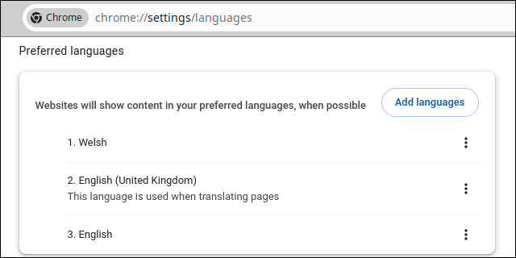
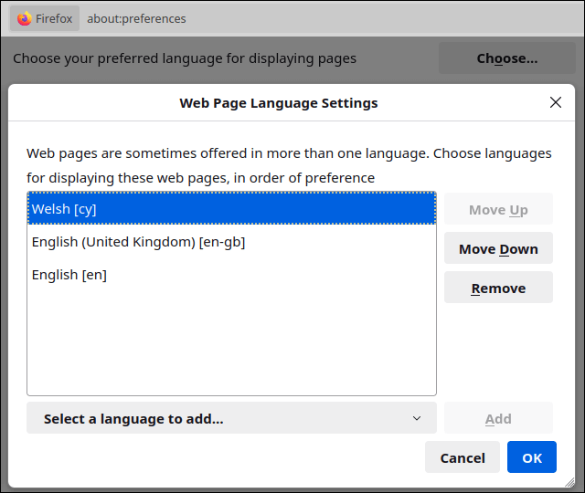

# preferred-language-fiddle

When getting [http://localhost:8080](http://localhost:8080), if ```cy``` is more highly ranked than ```en``` in the request's ```Accept-Language``` header user is forwarded to [http://localhost:8080/croeso](http://localhost:8080/croeso), else user is forwarded to [http://localhost:8080/welcome](http://localhost:8080/welcome)

Handles:

* Missing header (e.g. ```curl http://localhost:8080```)
* Empty header (e.g. ```curl -H 'Accept-Language:' http://localhost:8080```)
* Missing supported language tags (e.g. ```curl -H 'Accept-Language: cy' http://localhost:8080``` / ```curl -s -H 'Accept-Language: en' http://localhost:8080```)
* Additional unsupported language tags (e.g. ```curl -H 'Accept-Language: de,cy;q=0.9,en;q=0.8,fr;q=0.7,en-GB;q=0.6' http://localhost:8080```)
* Poorly ordered language tags (e.g. ```curl -H 'Accept-Language: fr;q=0.7,en;q=0.8,en-GB;q=0.6,de,cy;q=0.9' http://localhost:8080```)

## Run

```bash
go run .
```

## Web browser

Set the browser's page language settings as appropriate before requesting [http://localhost:8080](http://localhost:8080)

### Chrome



### Firefox


